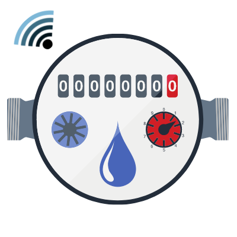
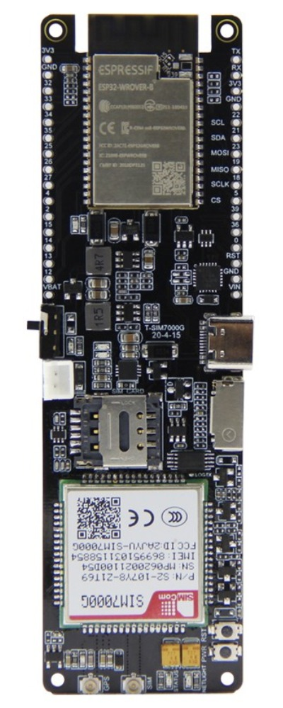
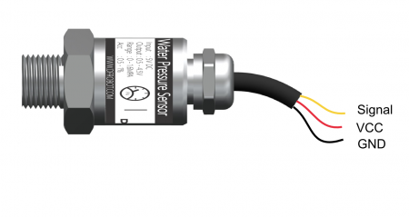
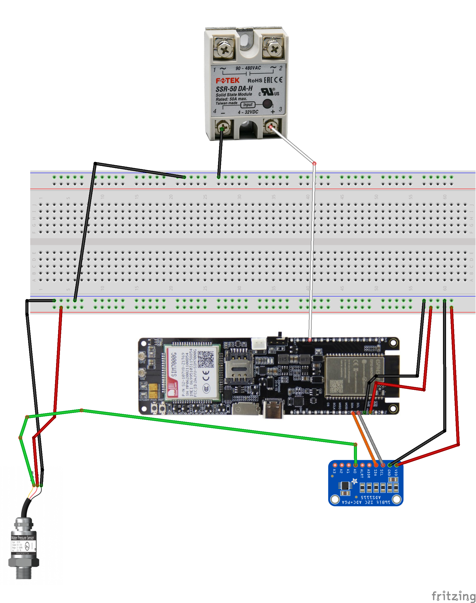
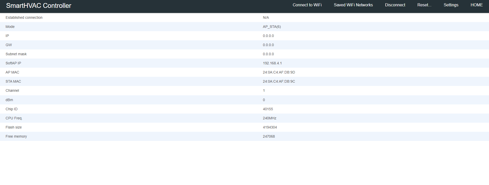
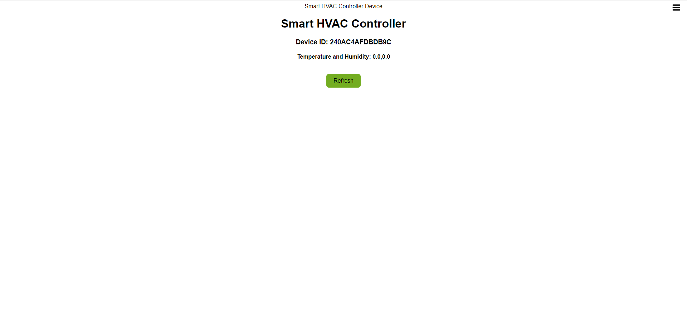

<p align="center">
  <a href="" rel="noopener">
 </a>
</p>

<h3 align="center">Smart Water Pressure Monitoring System</h3>

<div align="center">

[]()

</div>

---

<p align="center"> Smart Water Pressure Monitoring System
    <br> 
</p>

## 📝 Table of Contents

- [About](#about)
- [Getting Started](#getting_started)
- [Circuit](#circuit)
- [Usage](#usage)
- [Built Using](#built_using)
- [Authors](#authors)

## 🧐 About <a name = "about"></a>

This repo contains

- Backend
- Firmware
- Detailed instructions

for Smart Water Pressure Monitoring System.

## Getting Started <a name = "getting_started"></a>

These instructions will get you a copy of the project up and running on your system.

### Prerequisites

Things you need to install the FW.

```
- Arduino IDE
```

### Installing <a name = "installing"></a>

A step by step series that tell you how to get the Firmware and Backend running

#### ESP32 Configuration

You should have Arduino IDE Installed

1.  Add ESP32 Board to your Arduino IDE
1.  In your Arduino IDE, go to File> Preferences
    Installing ESP32 Add-on in Arduino IDE Windows, Mac OS X, Linux open preferences
1.  Enter `https://dl.espressif.com/dl/package_esp32_index.json`
    into the “Additional Board Manager URLs” field then, click the “OK” button:
    Note: if you already have the ESP32 boards URL, you can separate the URLs with a comma(each board will go to neaw line) as follows:
    `https://dl.espressif.com/dl/package_esp32_index.json,\n http://arduino.esp8266.com/stable/package_esp8266com_index.json`

1.  Open the Boards Manager. Go to Tools > Board > Boards Manager…
1.  Search for ESP32 and press install button for the ESP32 by Espressif Systems“:
1.  That’s it. It should be installed after a few seconds.
1.  In your Arduino sketchbook directory, create tools directory if it doesn't exist yet.
1.  Unpack the tool into tools directory(present in libs/ESP32FS-1.0.zip) (the path will look like <home_dir>/Arduino/tools/ESP32FS/tool/esp32fs.jar).
1.  Close and re-open the Arduino IDE.

1.  Now copy the contents of the libs folder to the libraries directory of your Arduino
    1. If you are using windows, the libraries directory will be Documents/Arduino/libraries

##### ESP32 Node FW Uploading

1.  Select ESP32 Dev Module from Tools->Board->ESP32
2.  Select the correct port from Tools->Port
3.  Then open Firmware.ino file,
4.  Select Tools > ESP32 Sketch Data Upload menu item. This should start uploading the files into ESP32 flash file system.
5.  Now Upload the Code to your ESP32 Dev Module.
6.  Your ESP32 is now ready to be used.

## Circuit <a name = "circuit"></a>

### ESP32 SIM7000 Pinout

Follow the pinout diagram given below to connect different components to your ESP32 SIM7000.



### Water Pressure Sensor Pinout

Water Pressure Sensor Pinout



### Complete Circuit Diagram

Here's the complete circuit diagram of the system.



### Other Components

```http
Other components pin connection details
```

#### Channle Relay Module(SSR or Mechanical)

```Relay Connected with ESP32 ```

| Relay Module Pins | ESP32 |
| :---------------- | :---- |
| `+`             | `14`  |
| `-`             | `GND` |


#### Water Pressure Sensor

```Water Pressure Sensor Connected with ADS1115 ```

| Water Pressure Sensor | ADS1115 |
| :---------------- | :---- |
| `Signal(Yellow)` | `A0`  |
| `VCC(Red)`             | `3.3V` |
| `GND(Black)`             | `GND` |

#### ADS1115

```ADS1115 Connected with ESP32 ```

| ADS1115 | ESP32 |
| :---------------- | :---- |
| `SCL` | `SCL`  |
| `SDA`             | `SDA` |
| `VDD`             | `3V3` |
| `GND`             | `GND` |

## Usage <a name = "usage"></a>

1.  Upload the code to your ESP32.
2.  Power on your ESP32, it will present you with an AP named `SmartWPM-abc` (while `SmartWPM` can be changed in the portal and `abc` is a unique id for each esp32) 
3.  Default captive portal password `123456789AP` which can be changed in captive portal. 
4.  Connect to the ESP32 access point and open the web-browser and navigate to the link `http://esp32.local/_ac`. This link will work on most of the operating systems but if your operating system is not allowing to open it, you may want to check the captive portal IP Address from the serial monitor and can use that IP address inplace of the above mentioned URL. 
5.  The default access IP Address is `http://192.168.4.1/_ac` 
6.  You will be presented with a main dashboard as shown below(based on your device)

7.  You can also open `http://esp32.local/` to see the DHT22 (humidity and temperature sensor live data).

8.  Once connected to a WiFi network, you can again access the captive portal using same URL or the IP Address from the Serial monitor.
9. You can open settings page with following default credentials
   1.  User: **AP Name (SmartWM)**
   2.  Password: **admin**
### WebApp

Web App is now running on your Server.
-   FrontEnd Address: http://10.7.77.1:8080
    -   Default UserName: admin@admin.com
    -   Default Password: admin
-   BackEnd Address: http://10.7.77.1:8000
-   PHPMyAdmin : http://10.7.77.1/phpmyadmin
    -   Default UserName: root
    -   Default Password: swpm-mysqldb
  
In WebApp folder there is a file named smartwaterpressure.sql which contains database
structure.

The webapp(frontend and backend) are running using PM.


## ⛏️ Built Using <a name = "built_using"></a>


- [Arduino](https://www.arduino.cc/) - Embedded Framework and IDE - For Sensor Node Design


## ✍️ Authors <a name = "authors"></a>

- [@Nauman3S](https://github.com/Nauman3S) - Development and Deployment
